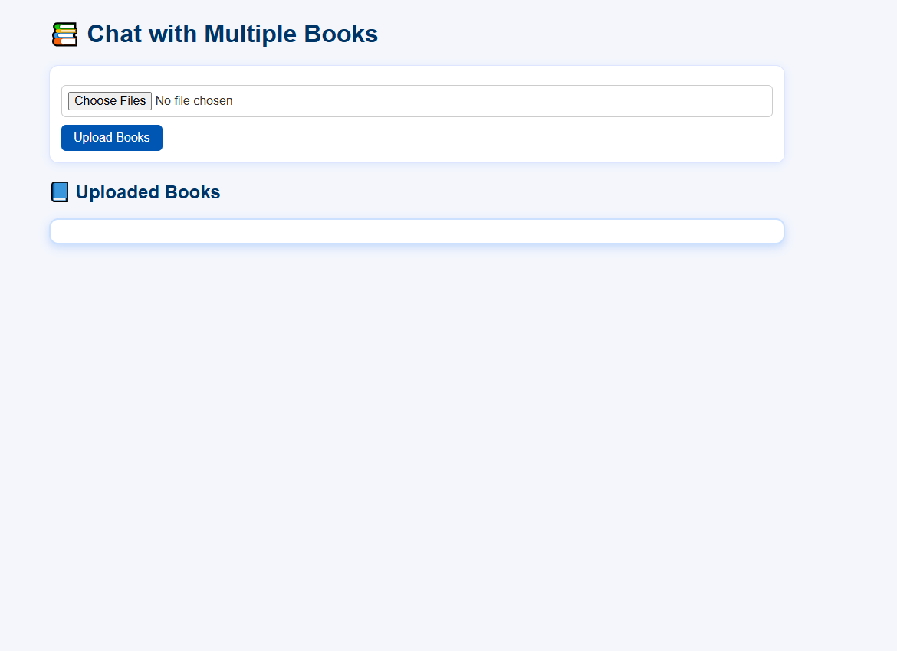

# 📚 Chat With Multiple Books using Ensemble Retrievers

An advanced Retrieval-Augmented Generation (RAG) system built with **FastAPI**, **LangChain**, **OpenAI**, **FAISS**, and **BM25**, allowing users to upload, index, and query multiple PDF documents. The app uses **Ensemble Retrieval** (FAISS + BM25) to provide highly accurate responses with a clean HTML/CSS frontend and persistent chat history.

---

## 🚀 Features

* Upload and index multiple PDFs
* Hybrid search using **FAISS** (semantic) and **BM25** (keyword) via `EnsembleRetriever`
* Chat with one or more books simultaneously
* Each book has its **own FAISS vector store and EnsembleRetriever**
* Query is federated across all selected books' retrievers
* Each document chunk stores its **book title as metadata** for context-aware responses
* Beautiful HTML/CSS frontend
* Persistent chat history with option to clear
* Dockerized for easy on-premise deployment

---

## 🧠 Technologies Used

* **FastAPI** - Backend API
* **LangChain** - Document pipeline and chaining
* **FAISS** - Vector similarity search
* **BM25Retriever** - Sparse keyword-based retrieval
* **OpenAI** - Embedding + Chat model
* **Jinja2** - HTML templating
* **Docker** - Containerization

---

## 📂 Project Structure

```
project-root/
├── main.py                  # FastAPI backend
├── Dockerfile               # For containerization
├── requirements.txt         # Python dependencies
├── templates/
│   └── index.html           # Frontend HTML
├── static/
│   └── style.css            # Frontend CSS
├── vectorstores/            # Stores FAISS vector indexes (auto-generated)
├── temp_pdfs/               # Temporarily stores uploaded PDFs
└── .gitignore               # Git ignore file
```

---

## 🧑‍💻 Installation & Local Setup

### 1. Clone the Repository

```bash
git clone https://github.com/your-username/chat-with-multiple-books.git
cd chat-with-multiple-books
```

### 2. Create a Virtual Environment (optional)

```bash
python -m venv venv
source venv/bin/activate  # On Windows use: venv\Scripts\activate
```

### 3. Install Dependencies

```bash
pip install -r requirements.txt
```

### 4. Add Your OpenAI Key in `main.py`

```python
os.environ["OPENAI_API_KEY"] = "your-openai-api-key"
```

### 5. Run the App

```bash
uvicorn main:app --reload
```

Then open [http://localhost:8000](http://localhost:8000) in your browser.

---

## 🐳 Docker Deployment

### 1. Build Docker Image

```bash
docker build -t multi-book-chat .
```

### 2. Run the Container

```bash
docker run -p 8000:8000 multi-book-chat
```

App will be live at: `http://<your-server-ip>:8000`

### Optional: Set Container to Auto-Restart

```bash
docker update --restart always multi-book-chat
```

---

## ⚙️ API Endpoints

| Endpoint         | Method | Description                          |
| ---------------- | ------ | ------------------------------------ |
| `/`              | GET    | Renders the main HTML page           |
| `/upload_books/` | POST   | Upload and index multiple PDFs       |
| `/books/`        | GET    | List all uploaded books              |
| `/multi_query/`  | POST   | Ask a question across selected books |
| `/delete_book/`  | DELETE | Delete selected book and its vector  |

---

## 🧠 How It Works

### 🏷 Metadata Handling

Each uploaded PDF is split into chunks using `RecursiveCharacterTextSplitter`. For every chunk, the book title is added as metadata:

```python
for chunk in chunks:
    chunk.metadata["book_title"] = title
```

This ensures that the LLM knows **where each chunk came from**, allowing it to provide source-specific, structured answers.

### 📦 Per-Book Ensemble Retrieval

For every uploaded book:

* A **FAISS vectorstore** is created and saved separately
* A **BM25Retriever** is initialized from the same chunks
* Both are combined into an **EnsembleRetriever**
* Stored in a dictionary for independent access

```python
retriever = EnsembleRetriever(
    retrievers=[vectorstore.as_retriever(), bm25],
    weights=[0.6, 0.4]
)
retriever_map[book_title] = retriever
```

### 🌐 Federated Querying

When a user asks a question across selected books:

* The app calls `invoke(query)` on each selected book’s retriever
* All retrieved documents are merged into a single context
* This context is passed to the LLM for response generation

```python
for book in selected_books:
    retriever = retriever_map[book]
    docs = retriever.invoke(query)
    combined_docs.extend(docs)
```

This **federated RAG** approach ensures the answer is synthesized from all relevant sources.

---

## 📸 Screenshots

| Interface                   | PDF's uploaded            | Q/A From Multiple Books     |
| --------------------------- | ------------------------- | --------------------------- |
|  |  |  |


---

## 📄 License

MIT License. Feel free to fork, improve, and use it in your own projects.

---

## 👨‍💼 Author

**Arqam Ansari** — [LinkedIn](https://www.linkedin.com/in/arqam-ansari-26ba8a269?utm_source=share&utm_campaign=share_via&utm_content=profile&utm_medium=android_app)
For collaboration or questions, feel free to open an issue or reach out!


